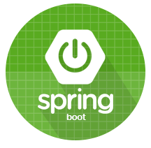
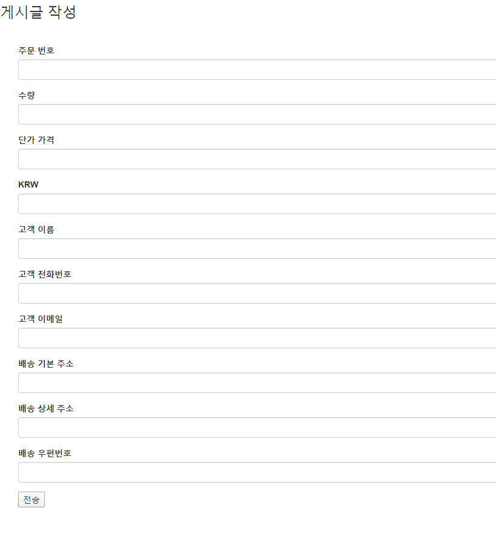
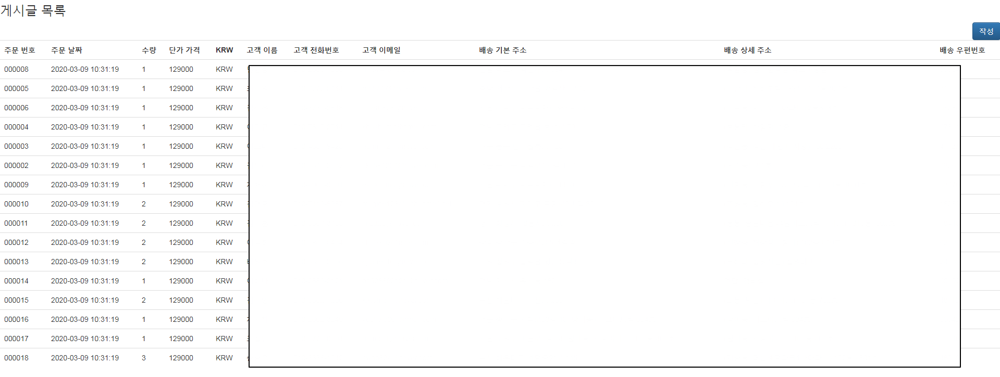
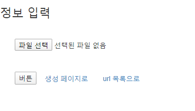
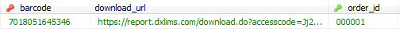
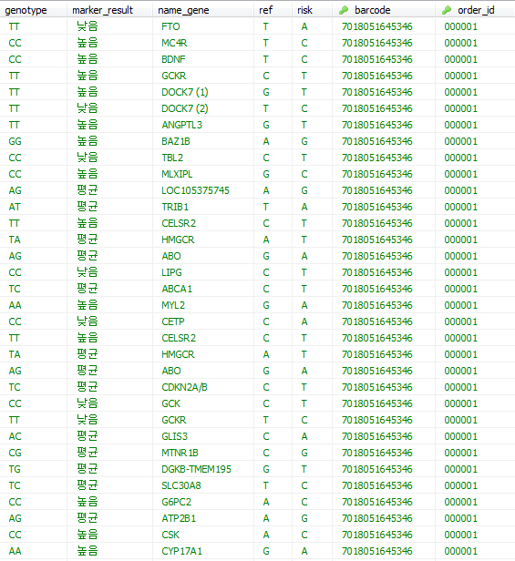
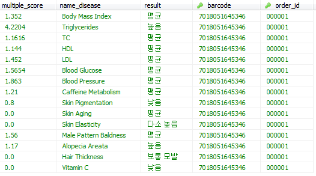

</img> 
# REST API 서버구축

스프링부트를 이용하여 유전자검사 업체와 데이터를 주고 받습니다. 정해진 json포맷으로 요청 및 반환 받습니다. 
유전자 업체로부터 반환 받은 데이터는 DB에 저장이되고 유전자 KIT배송 요청은 별도의 페이지를 만들어 입력 후 요청합니다.
***
# REST API JSON포맷
Method : post   
content type : application/json
* [ JSON 포맷 형식 파일](https://github.com/2jooho/springboot_dna_sol/blob/master/API%20Doc_20180927.docx "DOC")
***
# 의뢰 등록 페이지(URL)
1. [ kit 배송 요청] 

2. [ kit 배송 요청 리스트] 

3. [ 단일 pdf 업로드해서 url 생성] 

4. [ 업로드된 PDF 다운로드 URL ]  
    
~/downloadFile/(업로드한 파일 이름   

***   
# DB에 저장된 데이터

### `1. [ kit 관련 정보]` 

 

### `2. [ gene 관련 정보]` 

 

### `3. [ disease 관련 정보]`   
 
 

***

# 코드 소개

* board   

JSON 포맷에 맞도록 요청 후 정상적으로 등록되면 보낼 status, message   

* Controll   

MVC모델중 C로 JSON을 파서 하고 POST/GET 형식, Http 등에 대한 상세 코드   

* delivery   

바코드, url, 주문번호등을 db에 넣는 부분   

* domain   

유전자 결과 위험도 유전자 명 등을 db에 넣는 부분   

* property   

서버에 파일 업로드   

* upload   

업로드파일 정보 추출

*  selvice   

파일 업로드/다운로드 서비스 부분